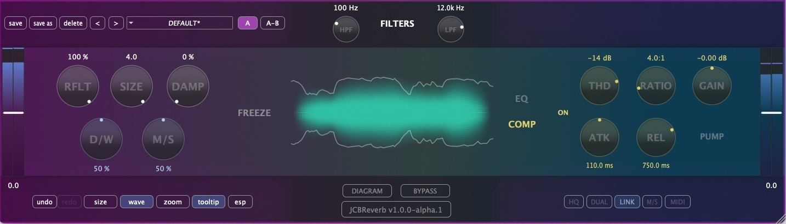
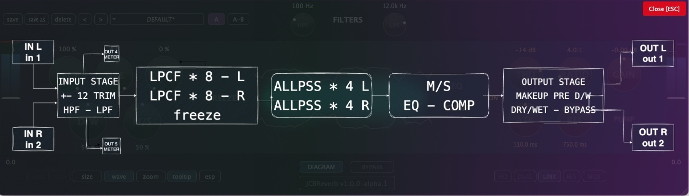

Reverb estéreo desarrollada en gen~, exportada con [gen~ Plugin Export](https://github.com/Cycling74/gen-plugin-export) y finalizada con [JUCE](https://github.com/juce-framework/JUCE). Forma parte de un conjunto de herramientas didácticas que utilizo en la asignatura de Técnicas de Grabación y Masterización para Música Electroacústica del [MCE](https://katarinagurska.com/curso-of/master-de-composicion-electroacustica-mce/). Originalmente creado con JUCE 6 hace unos años, el proyecto ha evolucionado significativamente en su interfaz gráfica y funcionalidad gracias al desarrollo con Claude Code y posteriormente con Codex CLI. Para más detalles técnicos, consulta [NOTAS.md](NOTAS.md).

## Instalación macOS
1. Descarga el archivo DMG desde la página de [Releases](https://github.com/cjitter/JCBReverb/releases)
2. Abre el DMG y ejecuta el instalador
3. El instalador colocará automáticamente los tipos de plugins seleccionados en las ubicaciones correctas del sistema:
   - VST3: `/Library/Audio/Plug-Ins/VST3/`
   - AU: `/Library/Audio/Plug-Ins/Components/`
   - AAX: `/Library/Application Support/Avid/Audio/Plug-Ins/`

*Nota: El DMG está firmado y notarizado para macOS.*

## Requisitos del sistema

- macOS 10.12 o posterior
- Procesador Intel o Apple Silicon
- DAW compatible con VST3, AU o AAX
- Probado en: Pro Tools, Reaper, Logic, Ableton Live y Bitwig

## Compilación desde código fuente

### Requisitos previos
- Git, [CMake](https://cmake.org) 3.20 o posterior, compilador Apple Clang compatible con C++20 (incluido en Xcode 13 o superior).
- [JUCE](https://github.com/juce-framework/JUCE) 8.0.8 (se descarga automáticamente via FetchContent)
- **AAX SDK**, solo requerido para compilar formato AAX - disponible desde cuenta de desarrollador Avid, etc.

### Instrucciones de compilación

1. Clona el repositorio:
```bash
git clone https://github.com/cjitter/JCBReverb.git
cd JCBReverb
```

2. **Configuración del proyecto**:
```bash
# Configurar proyecto Debug (VST3 y AU)
cmake -B build-debug -DCMAKE_BUILD_TYPE=Debug

# Configurar proyecto Release (VST3 y AU)
cmake -B build-release -DCMAKE_BUILD_TYPE=Release

# Configurar proyecto Debug/Release con AAX (requiere AAX SDK y Pro Tools Developer instalado)
cmake -B build-debug -DCMAKE_BUILD_TYPE=Debug -DJUCE_BUILD_AAX=ON
```

**Nota sobre generadores**: Por defecto, CMake usa Unix Makefiles en macOS. También puedes especificar otros generadores:
- **Ninja** (más rápido): `cmake -B build -G Ninja`
- **Xcode** (IDE nativo): `cmake -B build -G Xcode`

**Nota sobre AAX**: Si configuras con la opción AAX habilitada, cuando compiles el plugin se instalará automáticamente en `/Applications/Pro Tools Developer/Plug-Ins/` para testing con Pro Tools Developer.

3. **Compilación**:
```bash
# Compilar el proyecto configurado
cmake --build build-debug    # Para Debug
cmake --build build-release   # Para Release
```

## Características principales (v1.0.0)

- Reverb estéreo tipo Schroeder/Freeverb con controles musicales.
- Controles principales: Input Trim (±12 dB), Dry/Wet (0–100%), Size, Reflections, DAMP (0–100%), Stereo Width (M/S 0–100%).
- EQ 3 bandas en salida Wet: Low/Peak/High con frecuencias y ganancias (±24 dB) ajustables.
- Compresor en salida Wet: Threshold, Ratio, Attack, Release y Makeup (0.01 dB step). PUMP disponible solo con COMP ON.
- Visualizador: FFT y Waveform; Wave ajustado con gamma y autoescala para colas realistas, desacoplado de TRIM y Dry/Wet.
- Presets de fábrica y gestión de presets de usuario.
- UI/UX: botones y sliders con colores consistentes; tooltips bilingües (ES/EN); tabs EQ/COMP con acentos (#8F86D0/#DCCF6E).
- Medidores In/Out RMS/Peak y bypass suave sin latencia.

Nota: el overlay de diagrama es informativo y no interactivo con código GenExpr.



## Recursos

### Bibliografía técnica
- [Graham Wakefield & Gregory Taylor - *Generating Sound and Organizing Time*](https://cycling74.com/books/go)
- [Julius Smith - *Artificial Reverberation](https://ccrma.stanford.edu/~jos/pasp/Artificial_Reverberation.html)
- [Matthijs Hollemans - *The Complete Beginner's Guide to Audio Plug-in Development*](https://www.theaudioprogrammer.com/books/beginners-plugin-book)

## Por hacer

- Migrar de Plugin Export a la exportación C++ de RNBO.
- Integrar mapeo MIDI.
- Portar a SuperCollider los bloques de GenExpr o crear un UGen dedicado.

---

*© 2025 Juan Carlos Blancas – JCBReverb v1.0.0*
